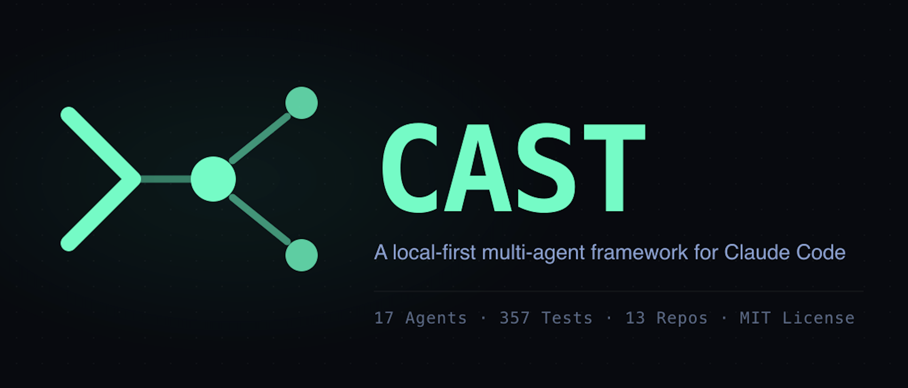

<!-- <p align="center">
  
</p> -->


**[CAST](https://castframework.dev)** — See the full agent team this dashboard was built for.

> **See Also — Native App:** For a native desktop experience with embedded PTY, see [cast-desktop](https://github.com/ek33450505/cast-desktop).

# Claude Code Dashboard

**Observability UI for the CAST Local-First AI Agent OS**

See every agent dispatch, session, hook status, and token cost -- live and historically -- without leaving your browser.

---

Running Claude Code with specialist agents is powerful but opaque. Which agents fired? What did they cost? Are the hooks actually working? Which sessions are burning budget on Sonnet when Haiku would have sufficed?

The dashboard answers all of that. It reads `~/.claude/` directly and streams live session data via SSE -- no accounts, no telemetry, no external services. It is the observability layer for [CAST](https://github.com/ek33450505/claude-agent-team), the model-driven agent dispatch system that runs alongside Claude Code.

The companion desktop app [cast-desktop](https://github.com/ek33450505/cast-desktop) provides a native Tauri interface to the same CAST data, with terminal-first ergonomics.

---

## Prerequisites

- **Node.js 18+**
- **A `~/.claude/` directory** -- present with any Claude Code installation
- **macOS or Linux**
- **CAST** (optional but recommended) -- installs the agents, hooks, and `cast.db` that power the full dashboard experience. Without CAST, session history and analytics views still work; hooks and DB panels degrade gracefully.

---

## Quick Start

### 1. Install the Agent Team (recommended)

```bash
git clone https://github.com/ek33450505/claude-agent-team.git
cd claude-agent-team && bash install.sh
```

Installs 23 specialist agents, slash commands, skills, hook handlers, and rules into `~/.claude/`. Runs alongside [Cast Desktop](https://github.com/ek33450505/cast-desktop) — a native Tauri app offering the same observability with a modern terminal interface.

### 2. Start the Dashboard

```bash
git clone https://github.com/ek33450505/claude-code-dashboard.git
cd claude-code-dashboard
npm install
npm run dev
```

React frontend at [http://localhost:5173](http://localhost:5173). Express API on port 3001.

### 3. Open Claude Code

Hooks are active immediately. Open any Claude Code session -- the model reads `CLAUDE.md` to dispatch agents, and the dashboard streams activity in real time.

---

## Pages

The dashboard covers the full observability surface across multiple pages.

| Page | Route | What it shows |
|---|---|---|
| Home | `/` | Live overview: active agents, today's cost, recent runs, system health |
| Sessions | `/sessions`, `/sessions/:project/:sessionId` | Full session history with token counts, cost, model, duration; JSONL detail drill-down |
| Analytics | `/analytics`, `/analytics/agents/:agent` | 30-day token burn, model tier breakdown, delegation savings, tool frequency, per-agent scorecard with drill-down; Compaction tab |
| Agents | `/agents` | Agent registry, live status, scorecard, run history with filters |
| Executive | `/executive` | Executive summary: KPIs for plans, pass-rate, hook failures, cost |
| Evals | `/evals` | CAST eval-harness results: pass@k per eval, by agent/model from eval_runs |
| Outputs | `/outputs` | Agent-generated briefings, meetings, and reports (filesystem source) |
| Agent Reliability | `/agent-reliability` | Hook reliability across 7 tabs: hallucinations, completeness, code-ref checks, unstaged warnings, truncations, protocol violations, worktree anomalies |
| Hooks | `/hooks` | Hook definitions and health status from `settings.json` |
| Memory | `/memory` | Searchable agent and project memory files; filterable by type; inline edit/delete; Consolidation section shows memory dream-cycle runs and archived memories |
| Plans | `/plans` | Implementation plan browser with JSON dispatch manifest detection |
| SQLite Explorer | `/system` (DB tab) | Paginated read-only browser for `cast.db` tables |
| Work Log | `/work-log` | Session event timeline and agent run history |
| Swarm | `/swarm` | Active and past CAST Agent Team swarm sessions; teammate roles, task status, token spend per teammate |
| Routines | `/routines` | Scheduled agent dispatch routines from cast.db |
| Incidents | `/incidents` | Episodic incident log from cast.db |
| Injection Log | `/injection-log` | Memory injection event log from cast.db |
| Hook Failures | `/hook-failures` | Hook execution failures and error logs |
| Docs | `/docs` | Documentation and help portal |
| System | `/system` | Tabbed control panel: Agents, Rules, Skills, Memory, Plans, DB, Cron |

Global search is available via `Cmd+K` -- searches sessions, agents, plans, and memories with keyboard navigation.


### Swarm Page (Agent Teams)

The Swarm page (`/swarm`) visualizes Claude Code native Agent Teams — parallel agent groups working on coordinated tasks. Includes a dedicated **Managed Agents** section showing Anthropic-hosted agents (beta) dispatched via `cast-managed-agent.sh`.

| Component | What it shows |
|---|---|
| SwarmCard | Team name, status, teammate count, elapsed time, total token spend (aggregated across all teammates) |
| TeammateRow | Per-role breakdown: agent definition, current task, status, individual token spend |
| TokenChart | Horizontal bar chart showing tokens_in + tokens_out per teammate role (Recharts visualization) |
| Managed Agents | Invocations of Anthropic-hosted agents with mode, HTTP status, exit code, and session duration |

All data is read from `swarm_sessions` and `teammate_runs` tables in `cast.db` (the `teammate_messages` table was retired in CAST v9). Polls every 5 seconds via TanStack Query for live updates.

### Agents Page

The Agents page (`/agents`) consolidates agent registry and run history into a single view.

**Agent Registry (card grid):**
- All agents displayed as sortable cards with name, model tier, description
- Active agents highlighted with emerald border
- Search by agent name or description
- Click agent card to drill into recent runs

**Active Agents Strip:**
- Compact horizontal list of currently running agents
- Shows model tier badge and elapsed time
- Real-time updates via SSE

**Scorecard (sortable table):**
- Total runs, success rate, average cost, last run timestamp
- Sort by any column (agent name, runs, success rate, cost, last run)
- Click to filter recent runs by agent

**Recent Runs (with filters):**
- Last 50 agent runs with timestamps, status, duration, token spend
- Filter by agent and status (DONE, DONE_WITH_CONCERNS, BLOCKED, NEEDS_CONTEXT)
- Hover for full task description

### System Tabs

The System page consolidates all configuration and tooling views into 11 tabs:

| Tab | What it shows |
|---|---|
| Agents | Full agent registry: model tiers, tool count, memory files; inline editing and new agent form |
| Rules | Rule file browser with previews |
| Skills | Skill definitions with metadata |
| Memory | Searchable agent and project memory files; filterable by type; inline edit/delete; backup status widget |
| Plans | Plan browser with JSON dispatch manifest detection and run button |
| DB | Read-only paginated browser for `cast.db` tables: sessions, agent_runs, routing_events, agent_memories, quality_gates, worktree_anomalies, agent_protocol_violations, tool_call_failures, eval_runs, dispatch_events, and more (all non-internal tables) |
| Cron | CAST-related crontab entries with CRUD |
| Chain Map | Dispatch routing diagram and agent delegation graph |
| Policies | Governance rules and quality gate configurations |
| Pricing | Model pricing and token cost breakdowns |
| Integrity | Litestream replication status and `cast integrity` results; rate-limit gauge |

---

## Architecture

```
                                                     ┌──────────────────┐
┌──────────────────┐     SSE (real-time)             │                  │
│                  │◀────────────────────────────────│   Express 5 API  │
│   React 19 SPA   │     REST (on demand)            │   Port 3001      │
│   Vite 6 + HMR   │◀────────────────────────────────│                  │
│   Port 5173      │     PUT/POST (editing)          │   chokidar watch │
│                  │────────────────────────────────▶│   JSONL parsing  │
│   TanStack Query │                                 │   gray-matter    │
│   React Router   │                                 │   better-sqlite3 │
│   Tailwind v4    │                                 └────────┬─────────┘
└──────────────────┘                                          │ reads/writes
                                                              ▼
                                                     ┌──────────────────┐
                                                     │   ~/.claude/     │
                                                     │                  │
                                                     │   projects/      │ ← session JSONL logs
                                                     │   agents/        │ ← agent definitions (r/w)
                                                     │   agent-memory-  │
                                                     │     local/       │ ← agent memories (r/w, flat-file)
                                                     │   commands/      │ ← slash commands
                                                     │   skills/        │ ← skill definitions
                                                     │   rules/         │ ← rule files
                                                     │   plans/         │ ← implementation plans
                                                     │   settings.json  │ ← configuration + hooks
                                                     │   settings.local │
                                                     │     .json        │ ← local overrides + hooks
                                                     │   cast.db        │ ← structured run history
                                                     └──────────────────┘
```

The Express server owns all `~/.claude/` I/O. The React SPA never touches the filesystem directly -- it fetches from the API and subscribes to the SSE stream. TanStack Query handles caching, stale-while-revalidate, and background refetch. Each route is wrapped in an `ErrorBoundary` so a broken view never crashes the rest of the app.

`castDbWatcher` polls `cast.db` every 3 seconds and pushes `db_change_agent_run`, `db_change_session`, and `db_change_routing_event` events over the `/api/events` SSE stream when new rows arrive. The React SPA subscribes to this stream and uses incoming events to invalidate TanStack Query caches immediately -- no polling intervals, no manual refresh.

The server performs **zero database writes at startup**. `cast.db` schema is owned exclusively by CAST's `cast-db-init.sh` canonical migrations. Seeding is an explicit, control-gated POST (`/api/cast/seed`) that fails closed (503) on a missing or uninitialized database.

---

## How It Connects to CAST

The dashboard is a read layer over what CAST writes. No CAST-specific code is required in the dashboard -- it just reads the files and database tables.

| File / Resource | Written by | Read by |
|---|---|---|
| `~/.claude/cast.db` (core tables) | CAST hooks (cost-tracker, agent-stop) | Dashboard, Sessions, Analytics, System (DB tab) |
| `~/.claude/cast.db` (`agent_memories` table) | CAST memory-router hook | System (Memory tab) |
| `~/.claude/cast.db` (`swarm_sessions`, `teammate_runs`, `teammate_messages` tables) | CAST Agent Teams hooks | Swarm page, System (DB tab) |
| `~/.claude/cast.db` (`agent_runs` table) | CAST agent-stop hook | Agents page, Analytics |
| `~/.claude/agent-memory-local/*/` | CAST agents (markdown files) | System (Memory tab) |
| `~/.claude/projects/*/` | Claude Code session runner | Sessions, Dashboard |
| `~/.claude/agents/`, `plans/`, etc. | CAST install + user | System (Agents, Plans tabs) |
| `~/.claude/settings.json` | Claude Code + CAST | System (Hooks tab) |

Install CAST v9 first for the full picture. The dashboard degrades gracefully if CAST is absent -- session history and analytics still work from raw JSONL. To see swarm and agent run data, CAST v9 with native Agent Teams is required.

---

## CAST Architecture

CAST uses **model-driven dispatch** -- `CLAUDE.md` contains a dispatch table that the model reads to decide which agent to call. No routing scripts, no regex patterns.

| Concept | Details |
|---|---|
| **Agents** | 23 specialists across 3 model tiers: Sonnet (complex tasks), Haiku (lightweight/review), Opus (long-context synthesis) |
| **Model tiers** | Sonnet (claude-sonnet-4-6), Haiku (claude-haiku-4-5), Opus (claude-opus-4-8) for workload-appropriate dispatch |
| **Hooks** | Quality gates: PostToolUse:Agent (code-reviewer auto-dispatch), PreToolUse:Bash (guard), cost-tracker, agent-stop (observability) |
| **Agent Teams** | Native Claude Code Agent Teams with parallel task execution and quality gate integration; hooks track teammate lifecycle |
| **Observability** | `cast.db` SQLite: agent_runs, sessions, routing_events, dispatch_decisions, agent_memories, quality_gates, otel_events/metrics, worktree_anomalies, incidents, and more |
| **Scheduling** | launchd (macOS) + RemoteTrigger |
| **Post-chain** | After code changes: code-reviewer -> commit -> push |

---

## Environment / Config

No `.env` file is required for local development. The server reads `~/.claude/` using the `HOME` environment variable.

| Variable | Default | Purpose |
|---|---|---|
| `PORT` | `3001` | Express API port. Override as an env var; also update the Vite proxy in `vite.config.ts` to match. |
| `CORS_ORIGIN` | `http://localhost:5173` | Allowed CORS origin for the Express server. |
| `CAST_DASHBOARD_CONTROL` | unset (OFF) | Set to `1` to enable the write/control endpoints (dispatch, cron mutations, rollback). Dashboard is read-only by default. |
| `DASHBOARD_TOKEN` | unset | Required token when control is enabled; clients send it via the `X-Dashboard-Token` header. Server enabled but token unconfigured → 503; missing/bad client token → 403. |

---

## Security — Read-Only by Default, Fail-Closed Mutations

The dashboard is **read-only out of the box**. All mutating endpoints return 404 when `CAST_DASHBOARD_CONTROL` is disabled (no telemetry of command availability). Enabled-but-unconfigured returns 503; bad/missing `DASHBOARD_TOKEN` header returns 403 (constant-time comparison).

**Mutating endpoints covered (fail-closed control gate):**
- `/api/cast/seed` — backfill token/cost data from JSONL
- `/api/control/dispatch` — spawn agents
- `/api/cast/task-queue/:id` — delete task
- `/api/cast/memories/:id` — delete memory
- `/api/cast/exec` — execute bash
- `/api/budget/config` — set daily limit
- `/api/memory/backup-trigger` — run backup script
- `/api/agents` — create agent (POST)
- `/api/agents/:name` — update agent (PUT)
- `/api/rules/:filename` — update rule (PUT)
- `/api/hook-events` — ingest hook payload
- `/api/sessions/:project/:id` — soft-delete session (DELETE)

All GET endpoints remain public. Rate limiters: 5 req/min on destructive ops, 10 req/min on seed/castd, no limits on observability reads.

- **Helmet:** All responses include security headers via Express helmet middleware.

---

## Schema-Drift Guard

On server startup, `server/utils/schemaGuard.ts` validates every `cast.db` table and column referenced by the dashboard routes against the canonical v9 CAST schema via `PRAGMA table_info`. A contract test (`server/__tests__/schemaContract.test.ts`) asserts that all expected columns exist, guarding against silent data loss when the CAST schema evolves. The dashboard never creates or alters tables — the canonical schema is owned exclusively by CAST's `cast-db-init.sh` migrations.

---

## Theming

**Dark/Light theme toggle** in the top navigation bar. Theme preference is persisted to `localStorage` (`cast-theme` key) and defaults to system preference (`prefers-color-scheme`). No flash-of-unstyled-content (FOUC) — theme loads synchronously on app bootstrap. Both themes meet WCAG-AA contrast requirements.

---

## Accessibility

The dashboard conforms to **WCAG 2.1 AA** standards:
- **Keyboard navigation:** All interactive controls are keyboard-accessible; roving-tabindex nav on tablists, Escape closes dialogs, focus-trap in modals.
- **Screen readers:** ARIA labels on icon-only buttons, chart labels, table headers; status pills announce severity and state.
- **Focus visibility:** Consistent `:focus-visible` rings on all interactive elements; visible on both dark and light themes.
- **Motion:** Entrance animations respect `prefers-reduced-motion` via Framer Motion config.
- **Contrast:** All text and meaningful icons meet 4.5:1 contrast in both themes.

---

## API Reference

### Sessions

| Endpoint | Method | Description |
|---|---|---|
| `/api/sessions` | GET | Session list with summary stats (supports `?project=` and `?limit=`) |
| `/api/sessions/:project/:id` | GET | Full JSONL entries for a session |
| `/api/sessions/:project/:id/export` | GET | Session as markdown export |
| `/api/sessions/:project/:id` | DELETE | Soft-delete a session (control-gated) |

### Agents

| Endpoint | Method | Description |
|---|---|---|
| `/api/agents` | GET | All installed agents with parsed frontmatter |
| `/api/agents/:name` | GET | Single agent with full markdown body |
| `/api/agents/:name` | PUT | Update agent frontmatter fields |
| `/api/agents` | POST | Create a new agent definition |
| `/api/agents/live` | GET | Currently running subagents |

### CAST / cast.db

| Endpoint | Method | Description |
|---|---|---|
| `/api/cast/token-spend` | GET | 30-day token/cost data from `cast.db` |
| `/api/cast/agent-runs` | GET | Agent run history from `cast.db` |
| `/api/cast/task-queue` | GET | Current task queue from `cast.db` |
| `/api/cast/memories` | GET | Agent memories from `cast.db` |
| `/api/cast/explore/tables` | GET | List allowed tables in `cast.db` |
| `/api/cast/explore/:table` | GET | Paginated read of a `cast.db` table |
| `/api/cast/seed` | POST | Backfill token data from JSONL into `cast.db` (control-gated; fails closed if DB missing) |
| `/api/cast/plans` | GET | Plans with manifest detection |
| `/api/completeness-events` | GET | Completeness events from cast.db (paginated) |
| `/api/code-ref-checks` | GET | Code reference check results from cast.db (paginated) |
| `/api/cast/cost-summary` | GET | Aggregated cost breakdown by model and top sessions |

### Swarm

| Endpoint | Method | Description |
|---|---|---|
| `/api/swarm/sessions` | GET | List of all swarm sessions (active and past), ordered by started_at DESC |
| `/api/swarm/sessions/:id` | GET | Single swarm session with all teammate_runs for that swarm_id |
| `/api/swarm/sessions/:id/messages` | GET | Teammate messages — returns empty (`teammate_messages` retired in CAST v9) |


### Analytics

| Endpoint | Method | Description |
|---|---|---|
| `/api/analytics` | GET | Cross-session token/cost aggregates |
| `/api/analytics/profile` | GET | Per-agent scorecard from `cast.db` |
| `/api/analytics/profile/:agent` | GET | Single-agent drill-down |

### Hooks and Routing

| Endpoint | Method | Description |
|---|---|---|
| `/api/hooks/health` | GET | Hook health: existence, executable bit, last fired |
| `/api/hooks` | GET | Hook definitions from settings files |
| `/api/hook-events` | POST | HTTP hook receiver -- accepts Claude Code hook payloads and broadcasts as `hook_event` SSE events |
| `/api/routing/events` | GET | Dispatch event log from `cast.db`; supports `?event_type=<type>` filter |
| `/api/routing/event-types` | GET | Distinct event types present in `cast.db` |
| `/api/routing/stats` | GET | Aggregate dispatch statistics |

### Observability

| Endpoint | Method | Description |
|---|---|---|
| `/api/eval-runs` | GET | CAST eval-harness results with pass@k metrics per eval, agent, and model tier |
| `/api/worktree-anomalies` | GET | Worktree state drift from `worktree_anomalies`; returns `{ anomalies, total }` |
| `/api/agent-truncations` | GET | Truncation events where agents' output was cut mid-response from `agent_truncations` |
| `/api/agent-protocol-violations` | GET | Protocol-level failures (missing handoff blocks, incorrect status) from `agent_protocol_violations` |
| `/api/managed-agents` | GET | Anthropic-hosted agent invocations and session data from `managed_agent_invocations` |
| `/api/rate-limits` | GET | Current rate-limit gauge and window data |
| `/api/memory-consolidation` | GET | Memory consolidation runs and archived memory count from `memory_consolidation_runs` |
| `/api/system/integrity` | GET | Litestream replication status and `cast integrity` verification results |
| `/api/dispatch-decisions` | GET | Scheduled dispatch events (currently served from `dispatch_events`; `dispatch_decisions` realignment scheduled) |
| `/api/executive-summary` | GET | Executive KPIs: plans, pass-rate, hook failures, cost aggregates |
| `/api/config/control` | GET | Reports whether control surface is enabled and whether DASHBOARD_TOKEN is configured (never returns the token value) |

### Control

**Write operations below (POST) require `CAST_DASHBOARD_CONTROL=1` and a valid `X-Dashboard-Token` header — the `controlGate` middleware returns 404 when disabled, 503 if enabled but unconfigured, and 403 for bad/missing tokens. Read-only `GET` endpoints (e.g. the queue) remain accessible.**

| Endpoint | Method | Description |
|---|---|---|
| `/api/control/dispatch` | POST | Spawn a CAST agent directly via `child_process.spawn`; tracked in `cast.db task_queue` |
| `/api/control/queue` | GET | Current task queue sorted by `queuedAt` |
| `/api/control/weekly-report` | POST | Run `cast-weekly-report.sh` and return output |

### Config and Knowledge

| Endpoint | Method | Description |
|---|---|---|
| `/api/config/health` | GET | System health overview (includes dashboard `version`) |
| `/api/memory` | GET | Project and agent memory files with `lastModified` timestamps |
| `/api/memory/backup-status` | GET | Last backup timestamp and log size |
| `/api/memory/backup-trigger` | POST | Run `cast-memory-backup.sh --dry-run` |
| `/api/plans` | GET | Implementation plan files |
| `/api/rules` | GET | Rule files with previews |
| `/api/skills` | GET | Skill definitions with metadata |
| `/api/commands` | GET | Slash commands |
| `/api/castd/status` | GET | Cron job status: CAST-related crontab entries |
| `/api/outputs/:category` | GET | Briefings, meetings, or reports |
| `/api/search?q=` | GET | Global search across sessions, agents, plans, memories |
| `/api/budget` | GET | Budget status from `cast.db` |

### Real-time

| Endpoint | Method | Description |
|---|---|---|
| `/api/events` | SSE | Real-time session and agent activity stream (exponential backoff reconnect); includes `db_change_agent_run`, `db_change_session`, and `db_change_routing_event` push events from `castDbWatcher` |

---

## Data Integrity

The v2.6.0 release hardens the dashboard's contract with CAST v9:

- **Zero startup writes** — The dashboard performs no database writes, alters, or creates on startup (verified via DB-hash smoke test). `cast.db` is owned exclusively by CAST.
- **Canonical schema enforcement** — `schemaGuard` certifies the v9 canonical schema; drift queries fail loudly, not silently.
- **Fail-closed control gate** — All 12 mutating endpoints return 404 when `CAST_DASHBOARD_CONTROL` is disabled; no bootstrap writes, no anonymous mutations.
- **Verified fresh-install** — A clean CAST v9 install passes every endpoint without 500s; task summaries source from canonical `dispatch_decisions.prompt_snippet`, not drifted columns.

See the full audit at `docs/audits/2026-07-02-v9-system-audit.md`.

---

## Stack

| Layer | Technology |
|---|---|
| Frontend | React 19, TypeScript, Tailwind CSS v4, Framer Motion |
| UI Components | shadcn/ui, Lucide React, cmdk (Cmd+K palette), sonner (toasts) |
| Charts | Recharts |
| Routing | React Router v6, React.lazy code splitting, per-route ErrorBoundary |
| State | TanStack Query v5, TanStack Virtual (virtualized lists) |
| Backend | Express 5, chokidar (file watching), tsx |
| Database | better-sqlite3 (`cast.db` -- sessions, agent runs, task queue, swarm sessions, teammate runs) |
| Parsing | gray-matter (YAML frontmatter), JSONL line reader |
| Testing | Vitest, React Testing Library |

---

## Development

```bash
npm run dev          # Start Express + Vite concurrently (API on :3001, UI on :5173)
npm run build        # Production build (tsc + vite)
npm run preview      # Serve the production build locally
npm test             # Run Vitest suite
```

---

## Local-First Design

Everything runs on your machine. No cloud, no telemetry, no external services.

- **Filesystem native** -- reads `~/.claude/` directly; agent definitions, memories, and configs are plain markdown and JSON
- **SQLite-backed** -- `cast.db` stores sessions, agent runs, task queue, memories, and budgets for structured queries
- **Human-editable** -- every config file is readable and editable outside the dashboard; nothing is locked in a database
- **No telemetry** -- no usage data sent anywhere; the server never phones home
- **No account required** -- no login, no API keys beyond what Claude Code already uses
- **Portable** -- `~/.claude/` is the source of truth; move it, back it up, version-control it

---

## About CAST

CAST (Claude Agent Specialist Team) is the companion framework this dashboard observes. It installs 23 specialist agents, hook scripts, slash commands, and quality gates into `~/.claude/`. Hooks fire on Claude Code interactions -- enforcing code review after edits, tracking dispatch costs, and logging session completions.

**Agent Teams:** Native Claude Code Agent Teams let you bootstrap parallel agent groups (frontend-dev + backend-dev + reviewer, for example) with seeded identity and quality gate rules. The dashboard's **Swarm page** shows team membership, task status, and token spend per teammate. The **Agents page** provides a comprehensive agent registry with live status, per-agent scorecard, and run history filters.

The dashboard reads what CAST writes: `cast.db` (agent runs, swarm sessions, teammate activity), agent definition files, and hook configurations. Install CAST v9+ for the full feature set with native Agent Teams observability.

[CAST on GitHub](https://github.com/ek33450505/claude-agent-team)

[CAST Framework (docs)](https://castframework.dev)

---

## Contributing

See [CONTRIBUTING.md](CONTRIBUTING.md) for guidelines.

---

Built by [Ed Kubiak](https://github.com/ek33450505). Part of the [CAST](https://github.com/ek33450505/claude-agent-team) system.

---

## CAST Ecosystem

> Auto-synced from [claude-agent-team/docs/ecosystem.md](https://github.com/ek33450505/claude-agent-team/blob/main/docs/ecosystem.md). Run `~/Projects/personal/claude-agent-team/scripts/sync-ecosystem-readme.sh` to refresh.

<!-- ECOSYSTEM_START -->
**Core Framework**

| Repo | Description | Latest | Install |
|---|---|---|---|
| [claude-agent-team](https://github.com/ek33450505/claude-agent-team) | Local-first multi-agent control plane — specialist agents, quality gates, hook enforcement, and the tamper-evident cast.db execution record. |  | `brew tap ek33450505/cast && brew install cast` |

**Observability**

| Repo | Description | Latest | Install |
|---|---|---|---|
| [claude-code-dashboard](https://github.com/ek33450505/claude-code-dashboard) | React observability UI — sessions, agent analytics, hook health, memory browser, SQLite explorer. |  | Clone from GitHub |
| [cast-desktop](https://github.com/ek33450505/cast-desktop) | Tauri 2 native app — embedded PTY terminal, command palette, 11 dashboard views. |  | `brew tap ek33450505/homebrew-cast-desktop && brew install cast-desktop` |

**Standalone Packages**

| Repo | Description | Latest | Install |
|---|---|---|---|
| [cast-mcp](https://github.com/ek33450505/cast-mcp) | Read-only MCP server over the Claude Code execution record (cast.db) — dispatch decisions, incidents, cost, sessions, and full-text search as 5 MCP tools + 5 resources. stdlib-only, strictly read-only. |  | `brew tap ek33450505/cast-mcp && brew install cast-mcp` |
| [cast-ledger](https://github.com/ek33450505/cast-ledger) | Signed, hash-chained, tamper-evident session receipts for Claude Code — SHA-256-stamped audit receipts from cast.db with `--verify`, plus an optional provenance hash-chain across sessions. |  | `brew tap ek33450505/cast-ledger && brew install cast-ledger` |
| [cast-predict](https://github.com/ek33450505/cast-predict) | Telemetry-driven dispatch prediction for Claude Code — reads cast.db to predict a task's likely cost, suggest agents, and surface related past incidents before you run it. |  | `brew tap ek33450505/cast-predict && brew install cast-predict` |
| [cast-memory](https://github.com/ek33450505/cast-memory) | Persistent agent memory for Claude Code — FTS5 full-text search, weighted relevance, temporal validity, Ollama embeddings, and weekly consolidation over cast.db. |  | `brew tap ek33450505/cast-memory && brew install cast-memory` |
| [cast-doctor](https://github.com/ek33450505/cast-doctor) | Standalone read-only health check for any Claude Code install — validates hooks, MCP config, agent frontmatter, cast.db core schema, and stale memories without the full CAST framework. |  | `brew tap ek33450505/cast-doctor && brew install cast-doctor` |
| [cast-time](https://github.com/ek33450505/cast-time) | Gives Claude Code a clock — injects local time, timezone, and a semantic time-of-day bucket at every SessionStart. |  | `brew tap ek33450505/cast-time && brew install cast-time` |
| [cast-claudes_journal](https://github.com/ek33450505/cast-claudes_journal) | Three-hook journaling for Claude Code (Stop/SessionStart/UserPromptSubmit) — maintains Claude's perspective and working memory across sessions as Obsidian-compatible markdown in ~/Documents/Claude/. |  | `brew tap ek33450505/homebrew-claudes-journal && brew install claudes-journal` |
<!-- ECOSYSTEM_END -->
